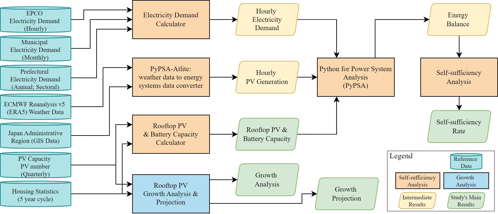

# Rooftop PV for Residential Electricity Self-Sufficiency: Assessing Potential Benefits in Major Japanese Cities

## Abstract

Rooftop photovoltaic (RTPV) systems have the potential to boost residential electricity self-sufficiency in urban areas significantly. However, estimating the self-sufficiency potential of each city is challenging due to the trade-off between target accuracy and data availability, which limits the scalability of existing methods. This study aims to evaluate the potential of RTPV systems to enhance residential electricity self-sufficiency in major Japanese cities. The self-sufficiency analysis employs a balanced approach using statistical data to estimate RTPV and battery storage capacity in detached houses and hourly simulations to capture supply-demand variations. To project the penetration rate, a logistic curve is utilized to estimate the timeline for achieving a 100% installation rate in detached houses. The analysis reveals that RTPV systems could supply approximately 40% of the residential electricity demand in major cities, with some achieving self-sufficiency rates exceeding 65%. Densely populated cities like Tokyo, Osaka, and Kawasaki may only meet a quarter of their demand due to higher energy requirements. Including older detached houses in RTPV deployment boosted self-sufficiency by an average of 11.77%, with cities like Nagoya, Kyoto, and Kitakyushu achieving increases of 15-20%. Battery storage plays a critical role in enhancing self-sufficiency and reducing energy curtailment. Logistic curve projections suggest that most cities are unlikely to reach 100% RTPV penetration before 2050, though leading cities could achieve 75% penetration by then due to favorable growth rates. These findings reveal that while RTPV has substantial potential to improve residential electricity self-sufficiency, additional efforts are necessary to accelerate adoption. Further research is needed to refine capacity estimates, explore the socio-economic and political context of the cities, and examine alternative pathways for cities like Tokyo, Osaka, and Kawasaki.

## Supplementary Data

This repository contains the Jupyter notebooks, configuration files, and documentation necessary to replicate the analyses performed in this study.

## Notebooks

The Jupyter notebooks listed below were used for the analysis and modeling conducted in this study. Each notebook corresponds to a major step in the methodology.



- [00-data-ingestion-and-preparation.ipynb](https://nbviewer.org/github/smdumlao/esm-jp-major-cities-rpv-potential/blob/main/00-data-ingestion-and-preparation.ipynb) - Consolidates the main data used in this study from various sources.  
- [01-city-hourly-demand.ipynb](https://nbviewer.org/github/smdumlao/esm-jp-major-cities-rpv-potential/blob/main/01-city-hourly-demand.ipynb) - Calculates hourly residential electricity demand.  
- [02-atlite-jp-main-cities-pv-gen-hourly.ipynb](https://nbviewer.org/github/smdumlao/esm-jp-major-cities-rpv-potential/blob/main/02-atlite-jp-main-cities-pv-gen-hourly.ipynb) - Computes the hourly capacity factor.  
- [03-rtpv-bat-capacity-calculation.ipynb](https://nbviewer.org/github/smdumlao/esm-jp-major-cities-rpv-potential/blob/main/03-rtpv-bat-capacity-calculation.ipynb) - Determines rooftop PV and battery capacity.  
- [04-pypsa-model.ipynb](https://nbviewer.org/github/smdumlao/esm-jp-major-cities-rpv-potential/blob/main/04-pypsa-model.ipynb) - Runs the optimization for six scenarios and saves the energy balance results.  
- [05-self-sufficiency-analysis.ipynb](https://nbviewer.org/github/smdumlao/esm-jp-major-cities-rpv-potential/blob/main/05-self-sufficiency-analysis.ipynb) - Analyzes the energy balance results. Results files are downloaded from Zenodo.  
- [06-rtpv-growth.ipynb](https://nbviewer.org/github/smdumlao/esm-jp-major-cities-rpv-potential/blob/main/06-rtpv-growth.ipynb) - Performs the analysis and projection of rooftop PV growth.  

### Notes

1. **Execution Time and Requirements**:  
   - `02-atlite-jp-main-cities-pv-gen-hourly.ipynb` requires downloading a cutout file (~1.2 GB) to generate the `pv_gen_kwh_per_kw_hourly_main_cities_fy2022.csv` file, which is subsequently used in `04-pypsa-model.ipynb`. Due to the time required to download the cutout file, the `pv_gen_kwh_per_kw_hourly_main_cities_fy2022.csv` file has been added to `data/ref`. Therefore, executing this notebook is not necessary to continue the analysis. The notebook is primarily provided for verification.

   - `04-pypsa-model.ipynb` requires installing `Gurobi`. The results of this notebook have been archived, making it unnecessary to execute this notebook to complete the analysis. The notebook is primarily provided for verification.

2. **Gurobi Installation**:  
   Academic users can refer to the [Gurobi Installation Guide for Academic Named-User](https://www.gurobi.com/features/academic-named-user-license/) for installation instructions.

3. **Independent Execution**:  
   All notebooks, except for `04-pypsa-model.ipynb`, can be executed independently. `04-pypsa-model.ipynb` requires the output of the preceding notebooks to complete its execution.

## Python Packages

To run the notebooks, please create a virtual environment and install the necessary Python packages:

```bash
pip install -r requirements.txt
```